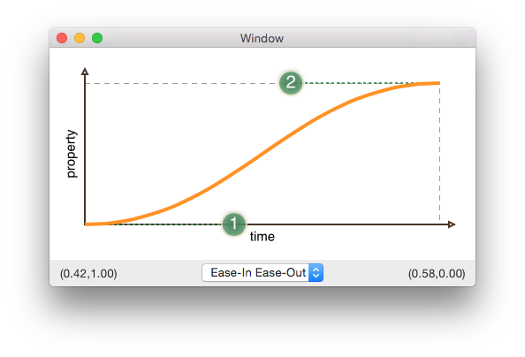

# B&eacute;zier Widget

An NSView for visualizing B&eacute;zier Curves. Built primarily with Core Animation timing curves (CAMediaTimingFunction) in mind.

The control points can be repositioned by dragging, or pre-defined CAMediaTimeFunctions can be selected from the pop-up.

### Screenshot

### Known Issues

I'm still trying to determine whether most of these are due to the newness of NSViewController, Swift, and Storyboards; failing to grasp subtleties of Core Animation on OS X; or flakiness due to using beta versions of the tools. These are things I would like to understand and fix:

* There is some hackery around layer-backed views. I find that when loading views from Storyboards using NSViewController, the layer has often not been created when viewDidLoad is called. Possibly there are some expected subtleties I'm failing to understand? There also seems to be out-and-out bugs here; it does not appear to be deterministic, as the same code will produce different results from run to run. It does seem this only happens with views loaded from Storyboards and xibs. Maybe.
* The position changes of the control points don't respect the animation duration, either in the implicit transaction or the animation itself.
* The change to the B&eacute;zier curve does not animate at all.
* There is a magic offset needed to get the drag-and-drop to positions precisely, and it's not the number I expected. Making the drawing inset adjustable and playing with different insets should provide more information.

### To Do

* Add further position constraints on the control points; restrict dragging them beyond the widget in all directions. Possibly restrict their positioning off-widget when laying out.
* Play with moving the pan gesture recoginzer to another view; possibly this allows for easy positioning of the widget within a larger drag area, with easy configuration using auto layout.
* Make drawing insets configurable; or at least build the logic around a variable rather than magic values. The inset allows the labels and axis arrows to extend beyond the (0,0) to (1,1)-bounded rectangle.
* Add IBInspectables; possibly colors and label text. Add IBDesignable.
* Possibly make work on iOS as well? A chance to play with conditional compilation in Swift...

### Acknowledgements

A big shout-out to [Mark Pospesel](http://markpospesel.com) and his [Animation3DSandbox](https://github.com/mpospese/Animation3DSandbox) for inspiration and a code example. His iOS version of this widget captured my mind at Renaissance 2012, and I couldn't help appropriating it. The visual appearance and drawing code draws heavily from what he did.
